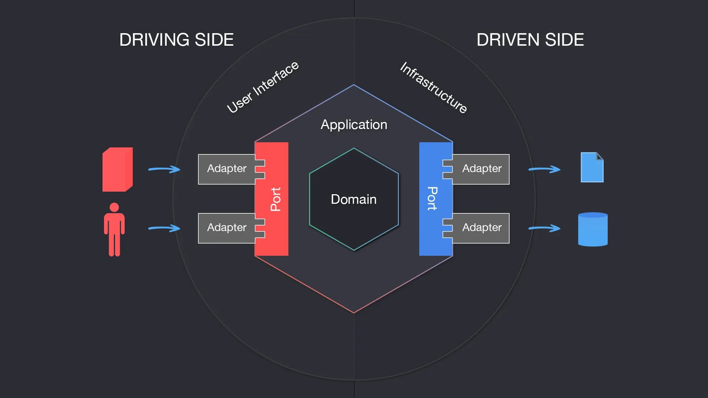

# What is Team?

Team is a BPMS open source Project (Business Process Management Systems) like Asana with features such as 
__communication system__ and __project management__.

---

# Tech Stack
- [x] __Golang__
- [x] __Kubernetes__
- [x] __Docker__
- [x] __GRPC__
- [x] __REST__
- [x] __Neo4j__
- [x] __Postgresql__
- [ ] __Rabbitmq__

---

# Architecture

Team developed by __Hexagonal Architecture__ and __Clean Architecture__  mindset especially   __Dependency Injection__  and __S.O.L.I.D__

## microservice Structure

each project have two main part __core__ and __adapter__.

### core
core is the main part of our app and contains business rules , port, domain and dto.
 and port (dependencies model) at the 

#### Usecase
 __usecase__ is a business rules but this component need other part for working well like dao
we model other part in port  and inject implementation of port on usecase
you can find   at the __app/internal/core/usecase__

### Port
port is a model of our dependency
you can find port on __app/internal/core/port__

#### DTO
dto or data transfer object is a standard for send and recive data from usecase 

### Adapter
each adapter is implementation of one port that injected in usecase we impliment somthing like query in this part. 

# THE GOLDEN RULE IS USECASE NOT DEPEND ON ANY THING

### Database Migration
you can find database migration on __app/assets__

## App lifecycle , What happens when we run cmd/main.go?

1. Read configs from env vars
2. In the second step we prepering our __driven port__ like database. at the end of this step we have a implementation of driven port
    1. when we need local data in this step we have a __database instance__.
    2. when we need a data from other microservices we have __sync or async commenication__ object like grpc or rabbitmq
3. In the third step we call the usecase and pass objects of step 2 for use as dao in usecase
4. In the last Pass usecase in the driver port implementation.

---
# Kubernetes
Each microservice have __app service__ , __app deployment__ , __configmap__ , __secret__ , __database deployment__ and __databse service__  

---
# Docker
Each microservice app have one docker file for development and on docker file for production(under dev) and have one docker compose with dev docker file and database image for development

---
# Status

| Microservice  | Status               |
| ------------- |:--------------------:|
| Customer      | Test and Develop     |
| Board         | Test and Develop     |
| Workspace     | Test and Develop     |
| Admin         | Test and Develop     |
| Notification  | Not Start            |
| Chat          | Not Start            |

---

# Todo
- [ ] Make reliable communication between with __saga pattern and circuit breaker pattern__
- [ ] Creating communication between __Admin and workspace , customer , board microservices.__ 
- [ ] __Develop and debug workspace microservice.__
- [ ] Develop Notification Microservice.
- [ ] __Creating Async communication with Rabbitmq between notification and other microservices__ 
- [ ] __Create BFF microservice for web__
- [ ] __Develop unit tests__
- [ ] __Develop chat microservice__

# Dtabase

| Microservice  | Database       |
| ------------- |:--------------:|
| Customer      | postgresql     |
| Board         | postgresql     |
| Workspace     | neo4j          |
| Admin         | postgresql     |

# feedback
## This project is under development, so you may see some problems in the code, in this case, please create a new issue.

